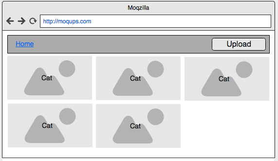
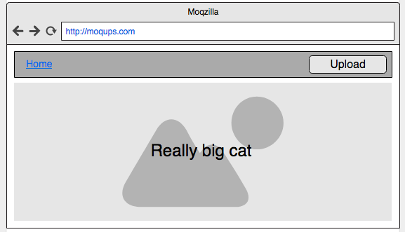

# React Sprint
### This was created during my time as a [Code Chrysalis](https://codechrysalis.io) Student

## Table of Contents

1.  [Introduction](#introduction)
1.  [Objectives](#objectives)
1.  [Overview of Topics](#overview-of-topics)
1.  [Environment](#environment)
1.  [Requirements](#requirements)
1.  [Installing Dependencies](#installing-dependencies)
1.  [Requirements & Instructions](#objectives-and-instructions)
1.  [Basic Requirements](#basic-requirements)
1.  [Advanced Requirements](#advanced)
1.  [Resources](#resources)
1.  [Contributing](#contributing)

## Introduction

Dive into React, one of the most popular front-end technologies and build modular, component-driven apps. As you build a photo-upload app, you will learn about the component lifecycle, its local state, the props passed to it, and much more.

## Objectives

In this task students will:

- Use JSX syntax in a real application
- Explain how parent and child components relate to functional composition
- Transfer state from parent components as props to children
- Use props to pass callbacks from parents to children (e.g. onclick, onadd, etc)
- Get used to the fine details of useState and useEffect

## Overview of Topics

React is a very large and popular ecosystem. While there are lots of different libraries that go hand-in-hand with it, the most important thing about it is that **you get to treat the ecosystem like a series building blocks**. Rather than learning everything at once, take the time to master the fundamentals of React. You will know when it is time to introduce other libraries that support React, like a Flux library such as Redux or a routing system such as React Router

> ### React.js
>
> [React](https://facebook.github.io/react/) is a JavaScript library created at Facebook. It's presented as _a library for building user interfaces_. React is incredibly popular in the web development world, with many prominent companies using it in production today.

There are some concepts you should know about React:

> #### React is Declarative
>
> With React, you explicitly write out XML-like code called **JSX**, which is then mounted on the Virtual DOM, an abstraction on top of the DOM which makes for faster visual changes. Because you write this markup language the same way you would expect HTML to be rendered on a page, it helps you debug faster and makes your code predictable.

> #### React is Component Based
>
> Build components that encapsulate their own data and nest them within each other to construct complex user interfaces, sharing data between them as necessary.

> #### Learn Once, Write Anywhere
>
> The React library powers frameworks such as React Native (for mobile development) and React VR (for virtual reality devices). Once you learn how to think and write in React, you can take that with you to multiple platforms.

These are the topics on React that we will cover in this sprint:

> #### JSX and Class vs className
>
> JSX is a syntactical extension to JavaScript and is the recommended way to write your UIs in React.

At a top level, it looks very much like XML and you will find that JSX also accepts HTML elements.

However, there is one major difference between JSX and HTML: How you declare classes.

In HTML, you would give an element a class like this:

```
  <div class="column">
    ...
  </div>
```

With JSX being an extension of JavaScript, React uses `camelCase` naming conventions and you will use `className` where you would normally use `class`:

```
  <div className="column">
    ...
  </div>
```

[Facebook's documentation on JSX](https://facebook.github.io/react/docs/introducing-jsx.html) is quite detailed and I recommend you check it out.

> #### State vs Props
>
> There are two different kinds of model data in React: **State** and **Props**.

**State** is data that is retained within a specific component. The methods and elements of that component interact with data stored in its State, allowing you to modify its contents whenever necessary.

**Props**, on the other hand, is data that is given to a component by its parent. It is the primary way for a parent component to pass data down to its child. To pass any type of data to a child component, simply add it as a prop when rendering that child component in your JSX:

```
  <MyComponent
    greeting="World"
    onClick={() => this.doSomething()}
  />
```

Above, I am giving a component titled **MyComponent** access to two props: A string called `greeting` and an anonymous function called `onClick`.

[This documentation on State and Lifecycle](https://facebook.github.io/react/docs/state-and-lifecycle.html) also goes through State and Props.

> #### Refs
>
> Normally, you interact with the handling of data in your React apps through **Props**. However, there are certain circumstances in which you may need to interact with a component outside of the normal process.

The [Facebook documentation on Refs](https://facebook.github.io/react/docs/refs-and-the-dom.html) is a great way to learn best practices on how to handle the use of Refs in your apps.

## Environment

### Installing Dependencies and Starting Up

First, install the dependencies for this project:

```shell
  $ yarn install
```

To run our unit test suite:

```shell
  $ yarn run test
```

To run the app in development mode with hot-reloading:

```shell
  $ yarn dev
```

To create a production build and serve them up using a static server

```shell
  $ yarn prod
```

**_In this project, tests have been written for you and your job is merely to get them to pass. Pay attention to how they work, because soon you will be asked to write your own tests using React, Jest, and Enzyme_**

## Requirements and Instructions

### Basic Requirements

Use the [React docs](https://facebook.github.io/react/docs/hello-world.html) to build your photo upload app using React. You will end up with five components: App, Navbar, Upload, AllPhotos, and SinglePhoto.

The first thing you should be comfortable with is [how to think in React](https://facebook.github.io/react/docs/thinking-in-react.html). These five components will be structured where some will be nested within others, with one main component being ultimately rendered into the DOM.

Your component hierarchy will end up resembling the following:

```
  App
    Navbar
      Upload
    AllPhotos/SinglePhoto
```

#### App

This component is the main entry point for your React app.

It maintains its own state, which consists of three items:

- [ ] `currentView`, a string that tells the component whether the user should be shown the AllPhotos or SinglePhoto view
- [ ] `photos`, an array of images represented as base-64 strings
- [ ] `selectedPhoto`, an image represented as a base-64 string

It is also responsible for rendering all of the other components:

- [ ] **Navbar**, which renders the navigation bar for the user. The Navbar is always shown regardless of view and should not be rendered
- [ ] Either **AllPhotos** or **SinglePhoto**, which renders either a grid of all photos or an enlarged version of just one single photo. This render is conditional, based on the `currentView` property of the **App** component's state

**App** should default to showing the **AllPhotos** component.

When **App** component mounts, the following should happen:

- [ ] It should use the utility methods found in the **utils/index.js** file to make a call to Amazon's S3 service to retrieve a list of all items stored on the pre-specified S3 bucket
- [ ] Then, it should grab each image from that list of items and store it into the `photos` array in the component's state

No need to worry about calling the **render** method of this component whenever the `photos` array is updated -- React will detect changes in a component's **state** and **props**, then trigger the **render** method on its own if a change that would cause a visual difference has been detected.

#### Navbar

This component should serve as your navigation bar for your React app. It should render a title along with the Upload component.

- [ ] The title should be a clickable element that, when clicked, will modify the value of the `currentView` string in the **App** component's state, changing it to `'AllPhotos'`. This is to provide the user with a method of navigating back to seeing the AllPhotos view. You should check out the React documentation on [Props](https://facebook.github.io/react/docs/components-and-props.html) on how to handle this interaction.
- [ ] It should render the Upload component and pass it a callback function as a prop. This callback should expect a file to be sent as an argument and is responsible for saving that file to S3 using one of the utility methods found in **utils/index.js** to do so. As a result of this, it should also update the photos array saved in the state of the **App** component.

#### Upload

- [ ] The Upload component renders a `button` element for the purposes of uploading an image
- [ ] The `input` element should allow users to select a an image file
- [ ] When an image file has been selected with the `input` element, it should ultimately send the file up to the Navbar component, again making use of React Props
- [ ] You should use the `button` element in the component to trigger a click event on the invisible `input` element. Check out the React documentation on [Refs](https://facebook.github.io/react/docs/refs-and-the-dom.html) for a look at how to accomplish this

#### AllPhotos

- [ ] It should render a grid of images based on an array of base64-encoded strings given to it as a prop
- [ ] The images should not take up the entire screen! Make sure their dimensions allow for a decently-sized grid of images
- [ ] This array of strings should be delivered as a prop by the parent **App** component
- [ ] Each image should be clickable, executing a function that will send the clicked image's index back up to the **App** component

At this point, the **App** component should be modified so that:

- [ ] Its render of the **AllPhotos** component contains a callback that will set the `selectedPhoto` property of its state to equal the base64-encoded string of the selected photo from the grid
- [ ] At that same time, it should switch the rendering of the **App** component so that it shows the **SinglePhoto** component instead of the **AllPhotos** component

#### SinglePhoto

- [ ] It should render a single image that takes up the entire screen!
- [ ] The image it renders should be passed into it as a prop from the **App** component
- [ ] This component should not contain its own state nor any lifecycle methods, as it is just responsible for rendering one single image.

#### Wireframes

- All Photos:



- Single Photo:



### Advanced Requirements

- [ ] Let's optimize the app so that it does not make a call to S3 upon every refresh. Have your app save the photos array to browser storage whenever it is updated, and call from it first when the app loads
- [ ] Add a refresh button to get all photos because of the above feature
- [ ] Add a progress bar or visual overlay while a photo is being uploaded, and make it disappear once the upload is complete
- [ ] Read into and refactor your app to use [React Hooks](https://reactjs.org/docs/hooks-intro.html)
- [ ] Add additional functionality, make this app yours, the sky is the limit.

## Resources

- [React Docs](https://facebook.github.io/react/)
  - [Props](https://facebook.github.io/react/docs/components-and-props.html)
  - [Refs](https://reactjs.org/docs/hooks-reference.html#useref)
- [Stateless Functional Components](https://hackernoon.com/react-stateless-functional-components-nine-wins-you-might-have-overlooked-997b0d933dbc)

## Contributing

Leave the below in the curriculum and delete this sentence.

See a problem? Can something be done better? [Contribute to our curriculum](mailto:hello@codechrysalis.io)!
